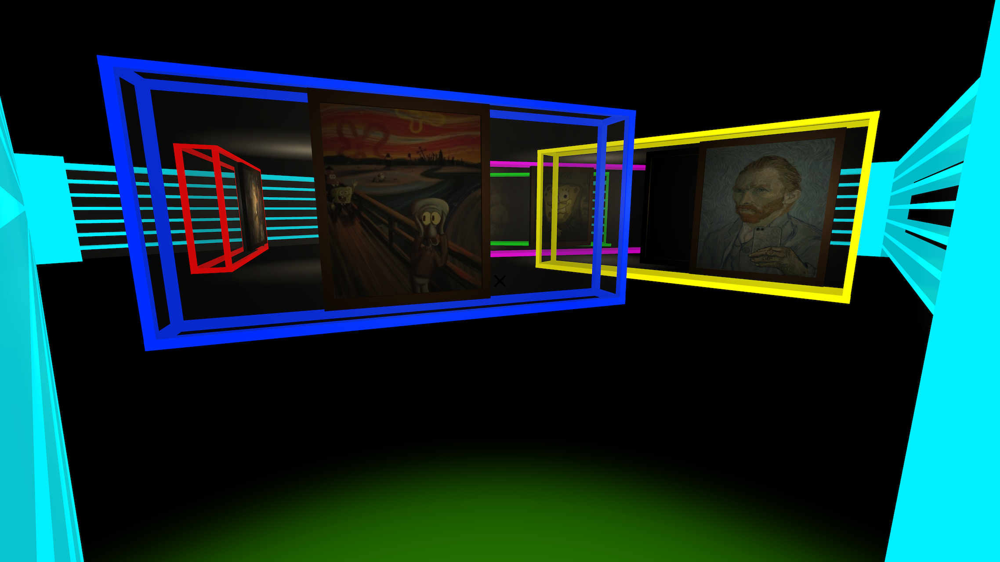

## SpaceJT

Author:  [Yuting Zhong](https://ununununium.github.io/Resume/), Xiaotong Guan

#### Description

---

SpaceJT is a treasure hunt game. While your are looking for treasures in an alien space station, you will experience an immersive space life.

#### Download Link

---

- Google Drive: https://drive.google.com/file/d/1rwzuYQ_8ObGV_jq_KMpj2mrwIciBIK_A/view

#### Screenshots

---

- Spaceship interior

  

- Spaceship and  space station exterior

  

- Tunnel connecting the spaceship and the space station

  

- Space station interior

  

  

  

- Food Bar

  

     

- The Hidden Room

  

- The Art Room

  

- Quest Completed

  